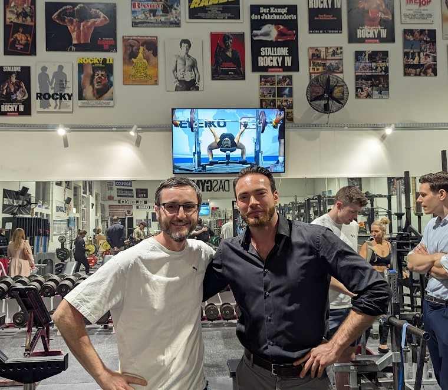
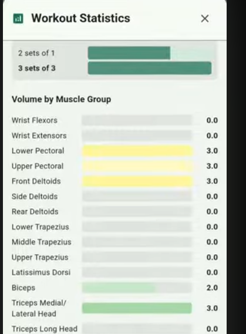

# BODY.BUILD
  
## Wikipedia brings articles
## What brings personalized fitness information & apps?

---

## Education first

Graduated *magna cum laude* from the Menno Henselmans PT Course. The most advanced course for personal trainers on the planet.

---

## 1) The database

- Detailed exercise information
- links to video content, studies, etc

---

## 2) Applications on top

- Program creator
- Kcal calculator
- Gym tracker
- Weight logging

---

# Program creator

Drag-and-drop with fractional volume counting

---

# Personalized Kcal & volume calculator

---

# Mobile Gym tracker

- Log sets
- Track progress and achievements
- See coverage
- Refine program (WIP)

---

# Weight logging

- With Moving averages and weekly trends

---

## Links

- <https://body.build>
- app store & play store
- <https://github.com/Dieterbe/body.build>
- <info@body.build>
